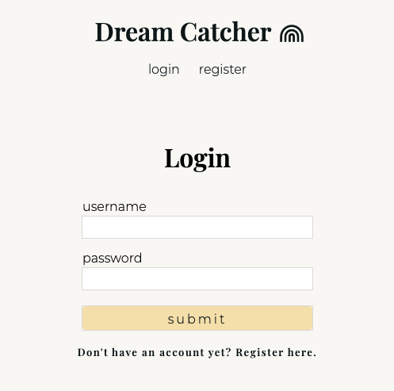
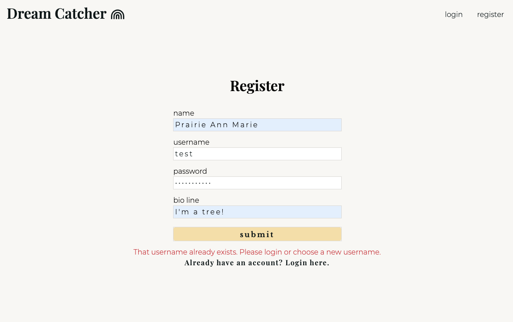
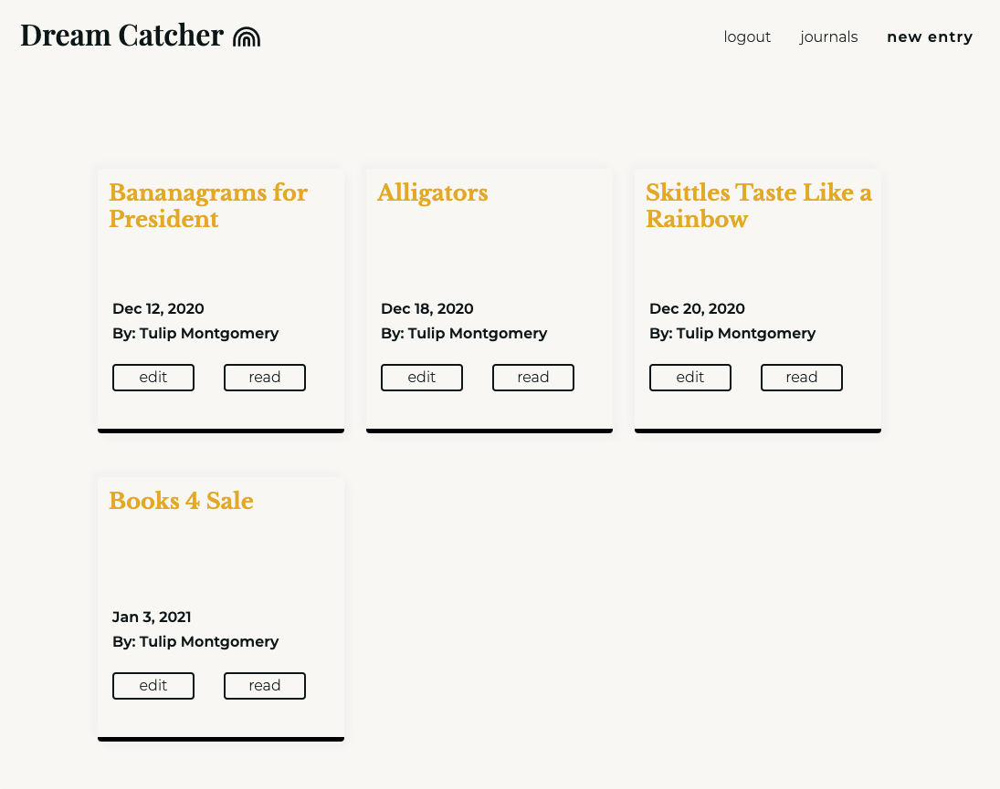
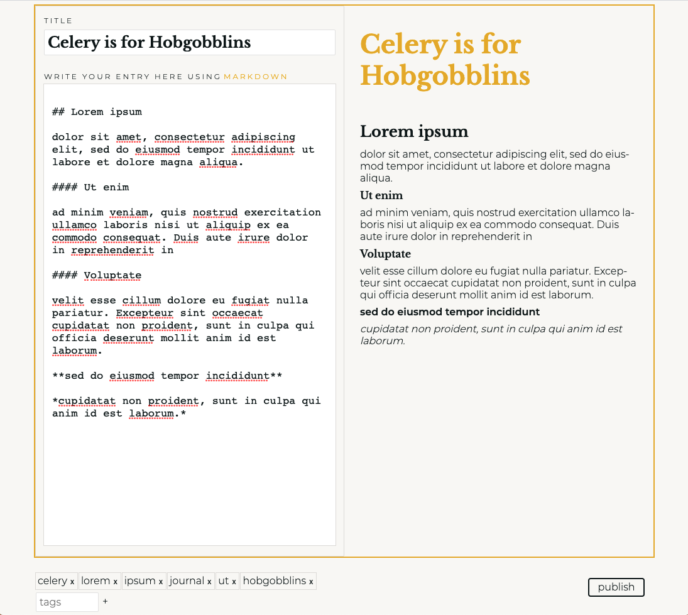
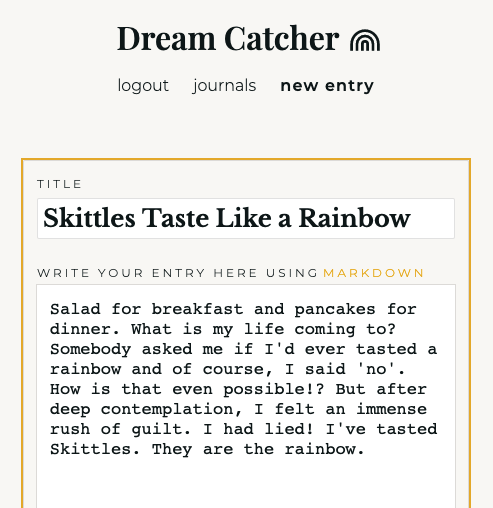
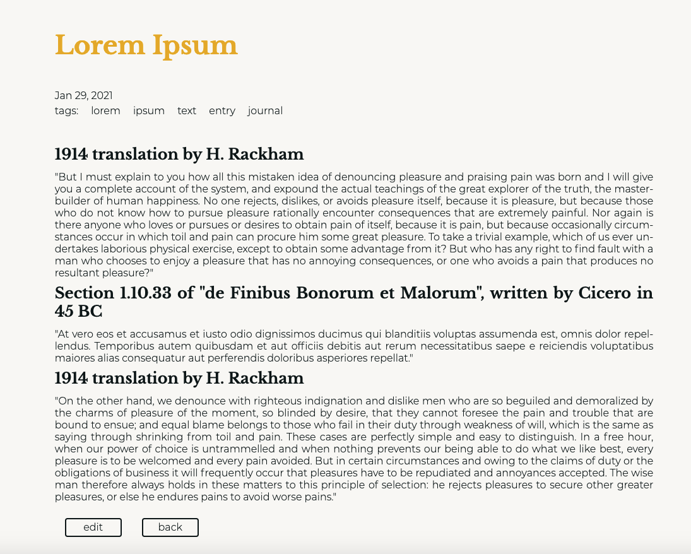
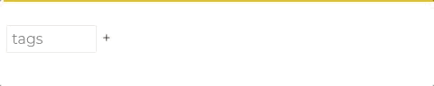

# Dream Catcher

Dream Catcher is a web app that allows users to register/login to write, read, and edit personal journal entries.

## Setup

Navgiate to the project directory

```sh
cd path/to/journal
```

Install dependencies

```sh
yarn # npm install
```

## Running the Application

```sh
yarn start # npm run start
```

**important note**

This is built for demonstration purposes on the front-end only. That means there is not a persistent database to store store users or their journal entries. If you run this app, all new journal entries and user infomration will be cleared upon refresh of the page.

## Tech Stack

- Javascript
- React
- React Router
- React Markdown
- Styled Components

## Screenshots

Login page - the entire app is responsive and can be used on mobile, tablet, laptop, or desktop



The login and register pages have error messages if a user attempts to enter invalid information



View of all user entries. They can be read or edited.



When creating a new journal entry on any screen larger than mobile, there is a side for markdown input and a side that shows a preview of how the text will render.



The mobile view of creating or editing a new journal entry



The read view of a journal entry when not in edit or create mode.



Tags can be added to posts. If using a keyboard, the backspace and enter buttons can be used to easily add and delete new tags. The + and x buttons can be used on mobile or desktop.



## Future Plans

- Originally, I wanted to add multiple themes a user could choose from and switch between. I have a themes file set up, so this could be done realtively easily.

- Adding a backend would allow this app to store persistent data and make it more realistically usable.

- I hope to add more functionality, for example a delete button on posts

- Fine-tune stlying and layout for improved UX.
